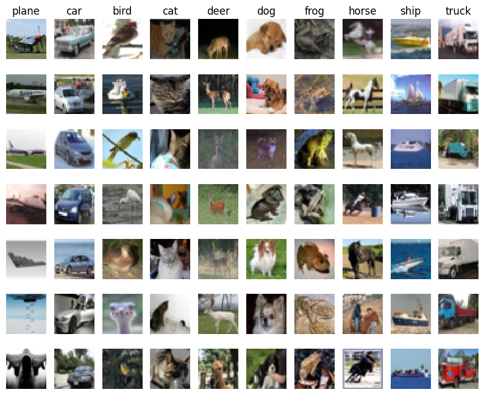
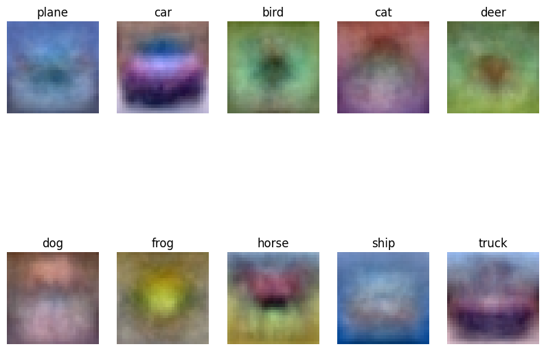
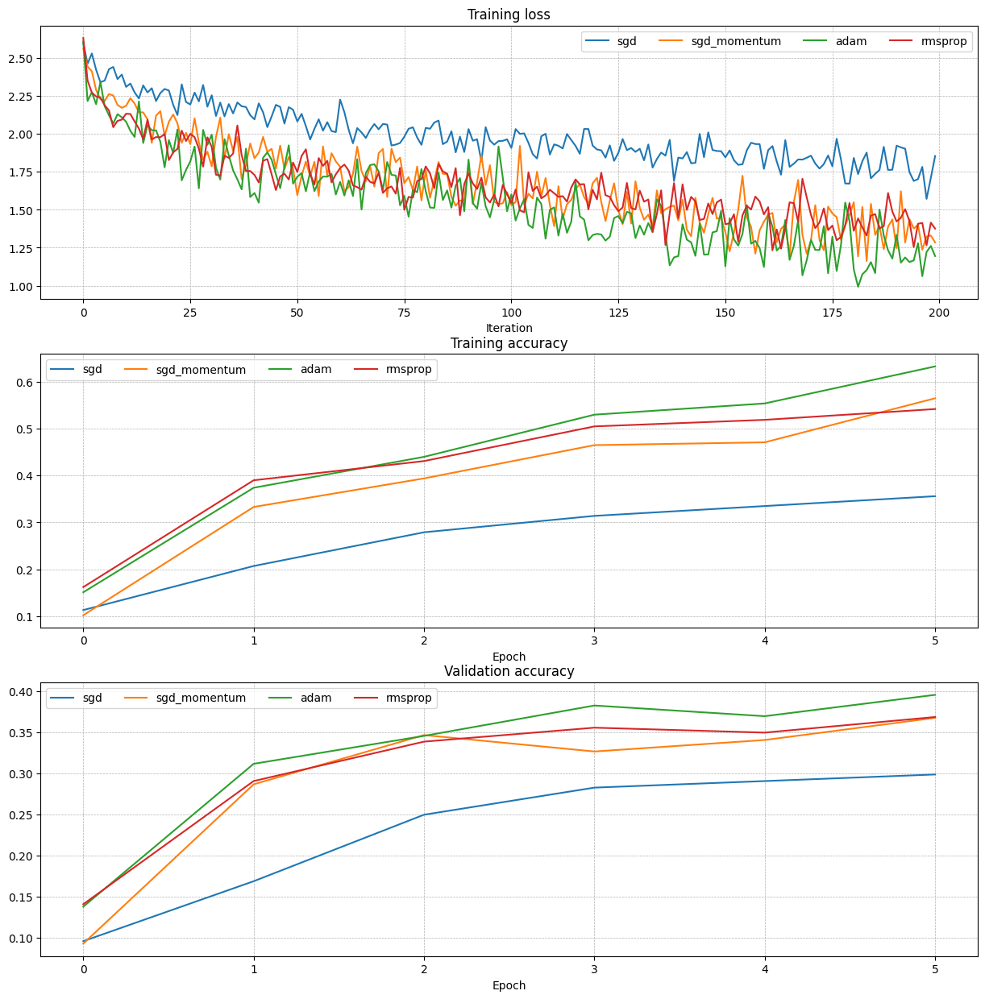

# neural-network-from-scratch

A NumPy-only implementation of core deep learning building blocks — linear classifiers,
fully connected networks, and the layers/optimizers/regularization techniques that make
them trainable — with no autograd and no deep learning framework in the forward/backward
math. Built as coursework for CSDC618 / DSCD604, in the style of Stanford's CS231n
assignments.

Everything is implemented from first principles: forward/backward passes, gradient
checking against numerical gradients, and a reusable `Solver` training loop.

<p align="center">
  
</p>

## What's implemented

**Classifiers** (`csdc618_dscd604/classifiers/`)
- `softmax.py` — vectorized softmax cross-entropy loss and gradient
- `linear_classifier.py` — SGD-trained linear classifier base class, with a `Softmax` subclass and model save/load
- `fc_net.py` — `TwoLayerNet` and a general `FullyConnectedNet` supporting an arbitrary number of hidden layers with:
  - ReLU activations
  - Dropout
  - Batch normalization
  - Layer normalization

**Core building blocks** (`csdc618_dscd604/`)
- `layers.py` / `layer_utils.py` — affine, ReLU, dropout, batchnorm, and layernorm forward/backward layers, composed into reusable blocks
- `optim.py` — SGD, SGD+momentum, RMSProp, and Adam update rules
- `solver.py` — training loop that handles minibatching, learning rate decay, checkpointing, and train/val accuracy tracking
- `gradient_check.py` — numerical gradient checking utilities used to validate every analytic backward pass
- `features.py` — HOG + color histogram feature extraction, used to test whether feature engineering improves a linear classifier over raw pixels
- `data_utils.py` / `vis_utils.py` — CIFAR-10 / ImageNet loading and visualization helpers

**Notebooks** (`notebooks/`, run top to bottom, each is self-contained)
- `q1_softmax.ipynb` — softmax classifier trained on CIFAR-10 with gradient checking and hyperparameter search
- `q2_two_layer_net.ipynb` — two-layer neural net trained end-to-end on CIFAR-10
- `q3_features.ipynb` — HOG/color-histogram feature extraction feeding into the linear classifiers
- `q4_fully_connected_nets.ipynb` — deep fully connected networks with dropout, batch norm, and layer norm, compared across optimizers
- `gather_submission_files.ipynb` — Colab-only helper that packages the notebooks/code into the course submission zip/PDF

## Results

| Softmax classifier — learned class weight templates | Optimizer comparison on a deep FC net |
| --- | --- |
|  |  |

The right-hand plot compares the custom `optim.py` update rules (SGD, SGD+momentum,
RMSProp, Adam) training the same `FullyConnectedNet` — Adam and RMSProp converge
fastest, plain SGD lags behind, matching expected behavior.

## Project structure

```
csdc618_dscd604/
  classifiers/           # softmax, linear classifier, fully connected nets
  datasets/               # dataset loading + get_datasets.sh (data itself is not committed)
  saved/                  # trained model weights (.npy, gitignored)
  layers.py, layer_utils.py, optim.py, solver.py, gradient_check.py, features.py, ...
notebooks/
  q1_softmax.ipynb
  q2_two_layer_net.ipynb
  q3_features.ipynb
  q4_fully_connected_nets.ipynb
  gather_submission_files.ipynb
docs/images/              # plots referenced by this README
requirements.txt
prepare_submission.sh     # packages notebooks + code into a submission zip (course tooling, do not edit)
makepdf.py                # renders notebooks to PDF
```

## Getting started

1. Create and activate a Python environment (Python 3.9+).
2. Install dependencies:
   ```bash
   pip install -r requirements.txt
   ```
3. Download the datasets (CIFAR-10 and a 25-image ImageNet validation subset):
   ```bash
   cd csdc618_dscd604/datasets
   bash get_datasets.sh
   cd ../..
   ```
4. Launch Jupyter from the repository root and open a notebook under `notebooks/`:
   ```bash
   jupyter notebook
   ```
   Each `q1`–`q4` notebook's very first cell resets the working directory to the repo root
   when opened from `notebooks/`, so `csdc618_dscd604` imports and dataset paths resolve
   correctly.

## Notes

- Code is designed to be run from the repository root so the `csdc618_dscd604` package resolves correctly.
- `q1`–`q4` notebooks were originally written for Google Colab and mount Google Drive in
  their second cell — skip that cell when running locally in Jupyter, since the cwd-fix
  cell before it already puts you at the repo root.
- Datasets are not committed to version control — fetch them with `get_datasets.sh`. Trained weights in `csdc618_dscd604/saved/` and generated PDFs/zips are likewise gitignored.
- `gradient_check.py` is used throughout the notebooks to numerically verify every custom backward pass before it's trusted for training.

## License

MIT — see [LICENSE](LICENSE).
